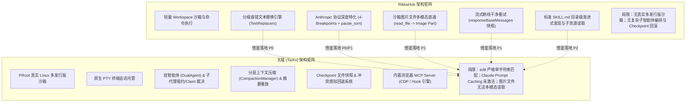
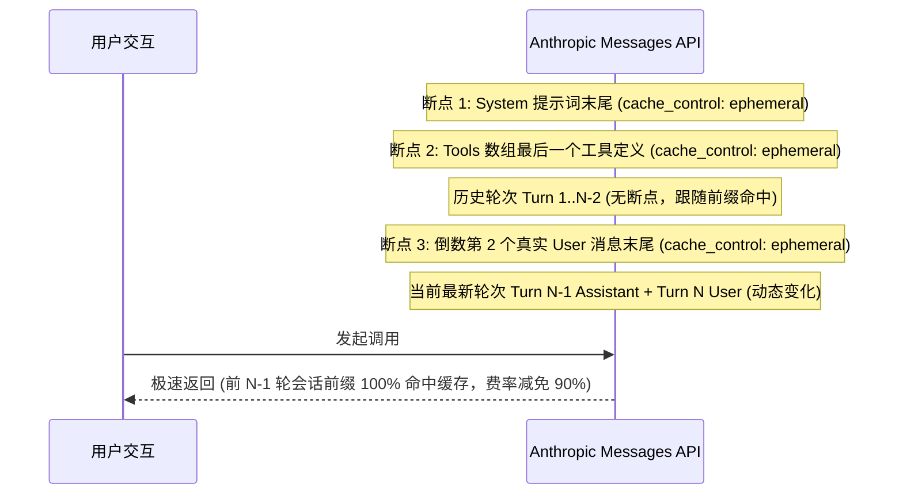
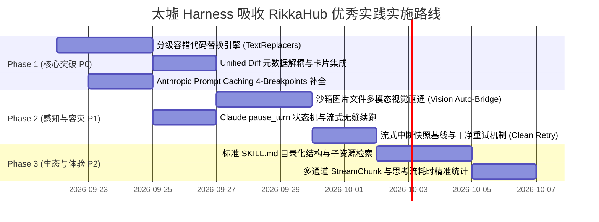
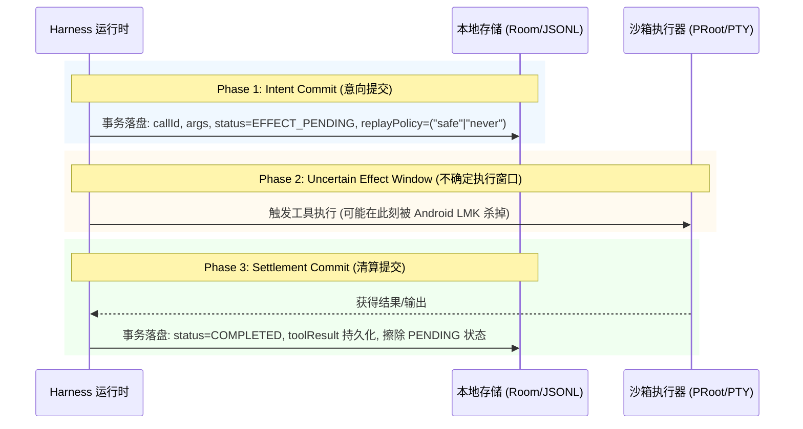
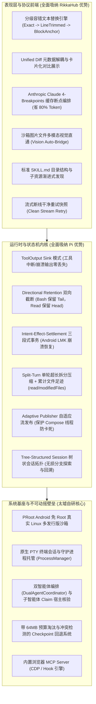

# 太墟 (TaiXu) Harness 架构对标与演进落盘规划 (RikkaHub × Pi 深度融合)

> 对标对象：
> 1. [rikkahub/rikkahub](https://github.com/rikkahub/rikkahub)（Android 原生多厂商 LLM 聚合客户端与工作区智能体，Kotlin + Jetpack Compose）  
> 2. [earendil-works/pi](https://github.com/earendil-works/pi)（工业级严谨度极高的终端 Coding Agent Harness 运行时规范）  
> 分析日期：2026-09-21  
> 方法论：深入研读 RikkaHub 的前端协议工程与交互打磨（TextReplacers、Prompt Cache、Vision Bridge），结合 Pi 的核心系统 Harness 规范（Tool Sinks、Directional Retention、Intent-Settlement 状态机、Split-Turn 压缩、Adaptive Publisher），逐项对照太墟当前 `harness` 模块源码，给出严谨、互不重复且各司其职的系统级落地方案。

---

## 1. 结论速览与技术定位对比 (Executive Summary)

太墟与 RikkaHub 虽然都是基于 Android + Kotlin + Jetpack Compose 构建的 AI 项目，但两者的系统定位与架构侧重有着鲜明的分野：

* **太墟 (TaiXu / LinuxAIRuntime)**：核心定位是 **Android 移动端 Linux 深度沙箱 + 专业 AI Agent 运行环境**。其架构优势集中在基础设施层与宏观编排层：基于 PRoot 的全功能 Linux 多发行版沙箱、原生 PTY 终端会话托管、双智能体编排（`DualAgentCoordinator`）、子智能体任务声明宿主裁决（`SubagentClaim`）、基于分层摘要与 Cache-Replay 的长会话上下文压缩（`CompactionManager`）、工业级 Checkpoint 文件快照与冲突感知回滚系统（`RewindController`）以及内置浏览器 MCP Server（支持 CDP 断点与 Hook 引擎）。
* **RikkaHub**：核心定位是 **Android 原生多模型聚合客户端与移动端轻量工作区智能体**。其架构优势集中在**大模型协议工程的微观精细打磨**：对主流闭源与开源大模型（OpenAI Responses API、Anthropic Claude、Google Gemini、Vertex AI、Ollama 等）最新协议规范的极致适配、代码编辑的高容错分级替换算法、沙箱产物的多模态视觉感知、移动弱网流式中断的干净重试机制、以及与业界标准对齐的目录级渐进式 Skill 发现机制。

### 核心收益与价值矩阵

对照 RikkaHub 的优秀工程设计，太墟当前在 Harness 层存在数个直接制约实际编码体验与 Token 成本的薄弱点。我们提炼出以下核心借鉴点，并设定明确的落地优先级：

| 优先级 | 借鉴条目 | 核心机制与改动点 | 太墟当前现状 (`harness`) | 预期收益 | 落地规划状态 |
| :--- | :--- | :--- | :--- | :--- | :--- |
| **P0** | **多级容错代码编辑引擎** | 引入 `Exact` $\to$ `LineTrimmed`（带目标缩进自动重排） $\to$ `BlockAnchor`（首尾锚点匹配）三级降级责任链；解耦 Unified Diff 元数据供前端渲染 | [`WorkspaceFileAccess.kt`](../harness/src/main/java/top/wkbin/taixu/harness/WorkspaceFileAccess.kt#L148-L151) 仅走严格 `indexOf`，空格/缩进/换行稍有偏差即报错 | **大幅提升模型代码修改成功率**，彻底消除缩进/CRLF 引起的“未找到匹配”，前端获得零上下文开销的 Git Diff 对比视图 | 规划中（第一阶段） |
| **P0** | **Anthropic Prompt Caching 4-Breakpoints 布局** | 在 System 尾部、Tools 尾部、**倒数第二轮真实用户消息**放置 `cache_control: {"type": "ephemeral"}`，支持 1h TTL 扩展 | [`AnthropicApi.kt`](../harness/src/main/java/top/wkbin/taixu/harness/AnthropicApi.kt#L210-L377) 仅解析 usage 统计，请求体内未注入任何 `cache_control` | **Claude 前缀缓存真正生效**，长会话输入 Token 计费直降 80%~90%，首字延迟 (TTFT) 缩减一个量级 | 规划中（第一阶段） |
| **P1** | **Anthropic `pause_turn` 续流状态机** | 捕获 `stop_reason == "pause_turn"` 原样回放 assistant 消息，重基服务端工具块索引 (`rebaseClaudeServerToolIndexes`) 并累加 Token | 太墟未处理 `pause_turn`，模型长时间思考或执行复杂长任务时会被意外截断或报错 | 完美契合 Claude 最新长推理与 Agent 托管协议，保障长任务连贯推进 | 规划中（第二阶段） |
| **P1** | **沙箱文件多模态视觉直通 (Vision Auto-Bridge)** | `read` 工具检测图片后缀时读取二进制转为 Base64/本地图片载荷，向多模态大模型输出视觉图像 | [`WorkspaceFileAccess.kt`](../harness/src/main/java/top/wkbin/taixu/harness/WorkspaceFileAccess.kt#L71) 强转 UTF-8，模型读取沙箱生成的图表/截图会乱码崩溃 | **赋予沙箱 Agent 视觉自我审查能力**，支持 Python/Matplotlib 作图、UI 渲染截图的闭环验证 | 规划中（第二阶段） |
| **P1** | **流式中断恢复的干净快照回滚 (Clean Stream Retry)** | 每次模型调用前建立干净消息快照基线，网络中断重发时重置缓冲区，严密隔离业务异常与网络异常 | [`HarnessProviderRunner.kt`](../harness/src/main/java/top/wkbin/taixu/harness/HarnessProviderRunner.kt#L69-L220) 具备网络重试，但需强化流式增量已渲染部分的无损擦除与状态幂等 | 彻底消除移动弱网环境下重复文字、半截 JSON 代码块污染后续对话上下文的问题 | 规划中（第二阶段） |
| **P2** | **目录级标准 SKILL.md 渐进式发现** | 系统提示词仅挂轻量 catalog 清单，`load_skill(name, path)` 按需深度读取 `SKILL.md` 正文及子脚本/参考资料 | [`BuiltinSkills.kt`](../core/model/src/main/java/top/wkbin/taixu/core/model/AgentSkill.kt#L22) 均为数据库单字段硬编码字符串，无法挂载复合项目资源 | 削减常驻系统提示词开销，与业界主流 Agent Skills 规范标准无缝对接 | 规划中（第三阶段） |
| **P2** | **多通道 StreamChunk 思考流与耗时统计** | 显式跟踪 Reasoning 的生命周期 (`createdAt` / `finishedAt`)，解耦 ServerTool 与 ClientTool | 太墟主要基于字符串增量拼接，思考耗时展示缺乏独立结构化事件流支撑 | 获得媲美顶级原生客户端的“已深度思考 3.8 秒”平滑状态展示与服务端工具透明感知 | 规划中（第三阶段） |

---

## 2. 架构级对比矩阵 (Taixu vs RikkaHub)



---

## 3. 关键技术点深度解剖与代码级规划

### 专题一：分级容错代码编辑引擎 (Multi-Tier Fault-Tolerant Text Replacer)

#### 1. 痛点剖析
在太墟当前的 [`WorkspaceFileAccess.kt`](../harness/src/main/java/top/wkbin/taixu/harness/WorkspaceFileAccess.kt#L148-L151) 中，`edit` 工具的实现如下：
```kotlin
val content = file.readText(Charsets.UTF_8)
val first = content.indexOf(oldText)
check(first >= 0) { "oldText 未找到" }
check(first == content.lastIndexOf(oldText)) { "oldText 匹配多处，请提供更精确的上下文" }
write(path, content.replaceRange(first, first + oldText.length, newText))
```
**现实痛点**：大模型生成代码修改时，普遍存在由于 Token 预测导致的微小瑕疵：
* 多余或遗漏缩进空格（例如原文件是 4 空格，模型输出了 2 空格或制表符）；
* 行尾多出或缺少空白字符；
* Windows CRLF 与 Linux LF 换行符的混淆。
只要发生以上任何微小偏差，严格的 `content.indexOf(oldText)` 就会立刻返回 `-1` 并抛出 `"oldText 未找到"`。模型不得不花费额外的轮次重新调用 `read`，甚至陷入死循环。

#### 2. RikkaHub 的算法实现分析
RikkaHub 的 `TextReplacers.kt` 定义了标准的三级降级匹配策略：

1. **第一级：`ExactReplacer` (严格匹配)**
   * 直接调用 `content.indexOf(oldText)`，保持最高速度与完全准确性。
2. **第二级：`LineTrimmedReplacer` (行级去空白容错 + 真实缩进重排)**
   * 将目标文本与搜索文本按行切分并分别去除首尾空白（`trim()`）。
   * 采用滑动窗口算法：在原文中滑动寻找行级去空白后与 `oldText` 行序列完全一致的区间。
   * **核心亮点（自动计算缩进）**：一旦命中，提取命中区间首行的真实缩进量（`oldIndent`）与 `newText` 的基准缩进量，自动对 `newText` 的每一行进行重新缩进对齐！保证替换后的代码语法缩进与原工程浑然一体。
3. **第三级：`BlockAnchorReplacer` (首尾锚点容错)**
   * 当待替换文本达到或超过 3 行时启用。
   * 仅匹配第一行与最后一行（去空白后相等），容忍中间行的细微差异。
   * 适用场景：模型在修改长函数或配置块时，中间某些无害行发生了轻微格式错乱。

#### 3. 太墟落地架构设计
在太墟 `harness` 模块内新建包 `top.wkbin.taixu.harness.text`：

```kotlin
package top.wkbin.taixu.harness.text

interface TextReplacer {
    val name: String
    fun findMatches(content: String, oldText: String, newText: String): List<Match>

    data class Match(
        val start: Int,
        val endExclusive: Int,
        val replacement: String,
    )
}

data class ReplaceTextResult(
    val updated: String,
    val replacements: Int,
    val occurrences: Int,
    val strategy: String,
    val diff: String? = null,
)

object ExactReplacer : TextReplacer {
    override val name: String = "exact"
    override fun findMatches(content: String, oldText: String, newText: String): List<TextReplacer.Match> {
        val matches = mutableListOf<TextReplacer.Match>()
        var index = content.indexOf(oldText)
        while (index >= 0) {
            matches += TextReplacer.Match(index, index + oldText.length, newText)
            index = content.indexOf(oldText, index + oldText.length)
        }
        return matches
    }
}

abstract class LineWindowReplacer : TextReplacer {
    protected abstract fun windowMatches(windowTrimmed: List<String>, oldTrimmed: List<String>): Boolean
    protected open fun isApplicable(oldTrimmed: List<String>): Boolean = oldTrimmed.any { it.isNotEmpty() }

    override fun findMatches(content: String, oldText: String, newText: String): List<TextReplacer.Match> {
        val rawOldLines = oldText.lines()
        val dropTrailingEmpty = rawOldLines.size > 1 && rawOldLines.last().isEmpty()
        val oldLines = if (dropTrailingEmpty) rawOldLines.dropLast(1) else rawOldLines
        val oldTrimmed = oldLines.map { it.trim() }
        if (!isApplicable(oldTrimmed)) return emptyList()
        val adjustedNewText = if (dropTrailingEmpty) newText.removeSuffix("\n").removeSuffix("\r") else newText

        val contentLines = splitLinesWithOffsets(content)
        val matches = mutableListOf<TextReplacer.Match>()
        var index = 0
        while (index + oldLines.size <= contentLines.size) {
            val window = contentLines.subList(index, index + oldLines.size)
            if (windowMatches(window.map { it.text.trim() }, oldTrimmed)) {
                val replacement = reindent(
                    text = adjustedNewText,
                    oldIndent = indentOf(oldLines.first()),
                    newIndent = indentOf(window.first().text),
                )
                matches += TextReplacer.Match(window.first().start, window.last().endExclusive, replacement)
                index += oldLines.size
            } else {
                index++
            }
        }
        return matches
    }
}

object LineTrimmedReplacer : LineWindowReplacer() {
    override val name: String = "line_trimmed"
    override fun windowMatches(windowTrimmed: List<String>, oldTrimmed: List<String>): Boolean =
        windowTrimmed == oldTrimmed
}

object BlockAnchorReplacer : LineWindowReplacer() {
    override val name: String = "block_anchor"
    override fun isApplicable(oldTrimmed: List<String>): Boolean =
        oldTrimmed.size >= 3 && oldTrimmed.first().isNotEmpty() && oldTrimmed.last().isNotEmpty()

    override fun windowMatches(windowTrimmed: List<String>, oldTrimmed: List<String>): Boolean =
        windowTrimmed.first() == oldTrimmed.first() && windowTrimmed.last() == oldTrimmed.last()
}
```

#### 4. Git Unified Diff 元数据解耦设计
在 `WorkspaceFileAccess.edit` 中生成标准 Unified Diff：
```kotlin
val result = TextReplacerEngine.replace(originalContent, oldText, newText)
val diff = UnifiedDiffGenerator.diff(originalContent, result.updated, path)
```
* **解耦契约**：生成的 `diff` 字符串存入 `ToolResult.metadata["diff"]`；
* **前端展示**：太墟 `feature/chat` 的 `ToolResultCard` 读取 `metadata["diff"]`，渲染高颜值的两栏/行内代码对比（复用已有的 `DiffView`）；
* **上下文保护**：在 `ApiContextAssembler` 组装发给大模型的上报报文时，仅输出简短文本（如 `已修改 path (匹配策略: line_trimmed, 1 处)`），**彻底剔除 diff 文本**，防止重复占用昂贵的上下文 Token。

---

### 专题二：Anthropic Claude 协议深度特化 (Prompt Caching 4-Breakpoints & pause_turn)

#### 1. 痛点剖析
查阅太墟当前的 [`AnthropicApi.kt`](../harness/src/main/java/top/wkbin/taixu/harness/AnthropicApi.kt)：
```kotlin
// AnthropicApi.kt:357
if (!model.pureChatMode && systemPrompt.isNotEmpty()) put("system", systemPrompt.toString())

// AnthropicApi.kt:360-374
if (!model.pureChatMode && model.toolCallMode == ToolCallMode.NATIVE && dynamicTools.isNotEmpty()) {
    put("tools", buildJsonArray {
        dynamicTools.forEach { definition ->
            add(buildJsonObject {
                put("name", definition.function.name)
                put("description", definition.function.description)
                put("input_schema", definition.function.parameters)
            })
        }
    })
}
```
**严重问题**：虽然代码后文解析了 `cache_read_input_tokens`，但整个请求中**压根没有注入任何 `cache_control` 标记**！这意味着 Claude 的 Prompt Caching 在太墟中实质上从未被触发，所有会话轮次均按全量价格计费，首字延迟居高不下。

#### 2. RikkaHub 的 4-Breakpoints 黄金排布策略
Anthropic 官方规定单次请求最多容纳 4 个缓存断点。RikkaHub 实现了极具数学美感与工程效能的排布：



* **为什么放在“倒数第二轮真实用户消息”？**
  * 在多轮对话中，当前最新轮次用户刚刚输入提问，内容是全新的；
  * 如果把断点放在最新用户消息，由于当前轮每次提问都不同，本次调用无法命中该断点；
  * 而**倒数第二轮用户消息及之前的所有对话内容，在上一轮就已经完全确定且再也不会改变**！
  * 因此，将第三个断点锚定在倒数第二轮用户消息末尾，可以确保当前请求除了最新这一句提问之外，前面的整个庞大历史树**全量命中前缀缓存**！

#### 3. 落地改造规格 (`AnthropicApi.kt`)
修改 `AnthropicApi.buildRequest`：
```kotlin
// 1. System Prompt 结构化 Block 转换
if (systemPrompt.isNotEmpty()) {
    put("system", buildJsonArray {
        add(buildJsonObject {
            put("type", "text")
            put("text", systemPrompt.toString())
            if (model.promptCachingEnabled) {
                put("cache_control", buildJsonObject { put("type", "ephemeral") })
            }
        })
    })
}

// 2. Tools 数组尾部注入缓存断点
if (model.toolCallMode == ToolCallMode.NATIVE && dynamicTools.isNotEmpty()) {
    put("tools", buildJsonArray {
        dynamicTools.forEachIndexed { i, def ->
            add(buildJsonObject {
                put("name", def.function.name)
                put("description", def.function.description)
                put("input_schema", def.function.parameters)
                if (model.promptCachingEnabled && i == dynamicTools.lastIndex) {
                    put("cache_control", buildJsonObject { put("type", "ephemeral") })
                }
            })
        }
    })
}

// 3. Messages 历史倒数第二轮 User 消息断点注入
val realUserIndices = anthropicMessages.mapIndexedNotNull { index, msg ->
    if (msg["role"]?.jsonPrimitive?.contentOrNull == "user") index else null
}
if (model.promptCachingEnabled && realUserIndices.size >= 2) {
    val targetIndex = realUserIndices[realUserIndices.size - 2]
    // 对 targetIndex 消息的最后一个 content block 注入 cache_control
    anthropicMessages[targetIndex] = injectCacheControlToMessage(anthropicMessages[targetIndex])
}
```

#### 4. Claude `pause_turn` 续流状态机
Anthropic 新规范中，当遇到超长 CoT 思考或长时间服务端任务时，可能返回 `stop_reason: "pause_turn"`。
RikkaHub 封装了 `streamClaudeWithPauseTurn`：
* **核心语义**：`pause_turn` 要求调用方**原样回传当前生成的 assistant 消息**继续请求，严禁插入任何人工 `"Continue"` 用户消息！
* **索引重基**：重基服务端工具块下标（`rebaseClaudeServerToolIndexes`），将连续两个流片段平滑拼接成一条无缝的完整回复，并累加中间轮次的 Token 统计。

---

### 专题三：沙箱文件多模态视觉直通 (Sandbox Workspace Multi-Modal Vision Auto-Bridge)

#### 1. 痛点剖析
太墟支持执行复杂的 Linux 命令和 Python 脚本。典型的场景：
* 用户：“帮我写个 Python 脚本，画出系统内存趋势图。”
* Agent 执行 Python 脚本生成了 `memory_trend.png`。
* 此时 Agent 为了验证画图是否正确，通常会下意识调用 `read(path="memory_trend.png")`。
* **现状后果**：[`WorkspaceFileAccess.kt`](../harness/src/main/java/top/wkbin/taixu/harness/WorkspaceFileAccess.kt#L71) 执行 `file.readText(Charsets.UTF_8)`，返回一堆二进制乱码或触发字符集异常，模型直接陷入混乱。

#### 2. RikkaHub 的视觉桥接机制
RikkaHub 在 `WorkspaceTools.kt` 中做了极佳的后缀探针：
```kotlin
private val IMAGE_EXTENSIONS = setOf("png", "jpg", "jpeg", "gif", "webp", "bmp", "svg", "ico")

if (path.isImagePath()) {
    workspaceRepository.readImageInRootfs(workspaceId, path)
} else {
    workspaceRepository.readTextInRootfs(workspaceId, path)
}
```
读取二进制字节后，将其转换为 `UIMessagePart.Image(url = "data:image/png;base64,...")`，作为工具执行结果传回给支持多模态的大模型。

#### 3. 太墟落地设计
在 `ToolExecutor.executeTool` 的 `HarnessTool.READ` 分支增加智能多模态探针：
```kotlin
HarnessTool.READ -> {
    val path = requireString(args, "path")
    val isImage = path.substringAfterLast('.', "").lowercase() in IMAGE_EXTENSIONS
    if (isImage && currentModel.supportsVision) {
        val bytes = activeFileAccess.readRawBytes(path)
        val base64 = Base64.encodeToString(bytes, Base64.NO_WRAP)
        val mimeType = resolveMimeType(path)
        ToolResult(
            success = true,
            output = "图片文件读取成功：$path",
            imagePayload = "data:$mimeType;base64,$base64" // 组装为多模态内容块注入下一步请求
        )
    } else {
        // 原有文本分页读取逻辑
        ...
    }
}
```
**收益**：使太墟沙箱内的 Agent 真正拥有了“眼睛”，能够进行前端 UI 渲染核验、自动化图像排版审查等闭环操作。

---

### 专题四：流式请求中断状态回滚与异常安全隔离 (Clean Stream Retry)

#### 1. 痛点剖析
在移动端场景下，WiFi 切换到 5G 或网络微弱闪断极为频繁。如果模型在流式输出到一半（例如已经吐出了 300 字）时连接重置（`SocketTimeoutException`）：
* 若简单进行原地上层重试，下一次重试的新流可能会拼接到前一次残留的半截字符之后；
* 若网络失败抛错，UI 上可能残留着一段尚未闭合的 Markdown 标签或残缺的 JSON 块。

#### 2. RikkaHub 的快照隔离机制
RikkaHub 在 `GenerationLoop.kt` 中树立了极其严密的异常屏障：
```kotlin
// 1. 在发起调用前，先锁定当前会话消息基线
val responseBaseMessages = if (messages.lastOrNull()?.role == MessageRole.ASSISTANT) {
    messages
} else {
    messages + UIMessage(role = MessageRole.ASSISTANT, parts = emptyList(), modelId = model.id)
}
var retryCount = 0

while (true) {
    val streamChunkHandler = StreamChunkHandler(model)
    var attemptMessages = responseBaseMessages // 每次重试都从完整、干净的快照重新累积！
    try {
        providerImpl.streamText(...).collect { chunk ->
            try {
                attemptMessages = streamChunkHandler.handle(attemptMessages, chunk)
                onUpdateMessages(attemptMessages)
            } catch (error: CancellationException) {
                throw error
            } catch (error: Throwable) {
                // 关键点：下游 UI 更新或本地转换异常不是网络故障，严禁误触发网络请求重放！
                throw StreamChunkHandlingException(error)
            }
        }
        messages = attemptMessages
        break
    } catch (error: Throwable) {
        if (error is StreamChunkHandlingException) {
            throw error.cause ?: error
        }
        // 仅对真正的底层 IOException 进行指数退避重试，并更新状态提示
        retryCount = awaitNetworkRetryOrThrow(error, retryCount, processingStatus, enabled)
    }
}
```

#### 3. 太墟落地建议
* 在 `TurnRunner` 与 `HarnessProviderRunner` 的流式处理循环中，引入 `StreamBaselineSnapshot` 机制；
* 区分 `CancellationException`（用户点击停止，秒级中断并保留已有内容）、`StreamChunkHandlingException`（本地解析/持久化异常，原样终止不重试）与 `IOException`（网络异常，彻底清空本轮已渲染的局部脏数据后干净退避重试）。

---

### 专题五：目录级标准 SKILL.md 渐进式发现与子资源读取

#### 1. 痛点剖析
太墟当前的技能系统定义在 [`AgentSkill.kt`](../core/model/src/main/java/top/wkbin/taixu/core/model/AgentSkill.kt#L6-L19)：
```kotlin
data class AgentSkill(
    val id: String,
    val name: String,
    val description: String,
    val systemPrompt: String,
    val triggerCommand: String? = null,
    val resourcePath: String? = null,
)
```
现存技能均通过写死的大段 `systemPrompt` 字符串注入。如果一个技能包含详细的使用示例、参考速查表或可执行 Python 脚本，将其全部写在 `systemPrompt` 中会导致加载后上下文迅速膨胀。

#### 2. RikkaHub 的标准 `use_skill` 模式
RikkaHub 遵循标准的 Agent Skill 结构（一个包含 `SKILL.md` 及子目录的文件夹）：
* 系统提示词中只暴露极度精简的元数据索引：
  ```xml
  <available_skills>
    <skill>
      <name>android_reverse</name>
      <description>Android 逆向与 APK 静态审计专家</description>
    </skill>
  </available_skills>
  ```
* 暴露标准工具 `use_skill(name, path)`：
  * 当 `path == null` 时：读取根目录 `SKILL.md` 的正文（自动剔除 YAML frontmatter）；
  * 当 `path` 指向子文件时（如 `references/smali_opcodes.md` 或 `scripts/dump_dex.sh`）：在沙箱内按受限相对路径读取该辅助文件。

#### 3. 太墟落地建议
* 保持现有 `HarnessTool.LOAD_SKILL` 枚举不变，扩展其入参为 `(name: String, path: String? = null)`；
* 统一支持读取太墟内置私有目录（`skills/`）以及沙箱工作区内项目根目录（`.agents/skills/`）的标准 Skill 结构，实现与开源社区 Skills 的开箱即用兼容。

---

## 4. 实施落地全周期规划 (Implementation Roadmap)



### Phase 1：代码编辑稳健度与 Claude 成本断崖式优化 (预计周期：5 天)
* **交付物 1**：实现 `top.wkbin.taixu.harness.text.TextReplacers`，包含单元测试（覆盖 Exact、LineTrimmed 缩进对齐、BlockAnchor 边界情况、CRLF/LF 混合换行符）；
* **交付物 2**：修改 `WorkspaceFileAccess.edit`，集成多级替换引擎，成功后输出 Unified Diff 并附在 `ToolResult.metadata`；
* **交付物 3**：重构 `AnthropicApi.kt` 的 `buildRequest`，注入 System、Tools 与倒数第二轮 User 消息的 `cache_control`，并验证缓存命中率指标。

### Phase 2：多模态闭环与长思考容灾 (预计周期：5 天)
* **交付物 1**：在 `ToolExecutor.executeTool(HarnessTool.READ)` 中增加视觉模型图片探针，实现沙箱图片文件的自动 Base64/多模态块封装；
* **交付物 2**：在 `AnthropicApi` 中实现 `pause_turn` 捕获循环与工具块下标重基；
* **交付物 3**：在 `TurnRunner` 中固化流式初始快照，确保网络闪断退避重试时无脏字符残留。

### Phase 3：技能规范拉齐与思考耗时度量 (预计周期：5 天)
* **交付物 1**：扩展 `HarnessTool.LOAD_SKILL` 为支持 `(name, path)`，打通工作区 `.agents/skills` 目录结构；
* **交付物 2**：重构思考流生命周期管理，向前端提供确切的毫秒级“思考耗时”展示。

---

## 5. 太墟不可动摇的核心壁垒 (Core Tenets to Preserve)

在借鉴外部优秀实践的同时，太墟**必须绝对保持自身已有的核心系统优势，严禁倒退或盲目重构**：

1. **绝对坚持基于 PRoot 的全功能 Linux 多发行版沙箱**：
   * RikkaHub 的工作区本质上是轻量目录与受限进程执行；太墟具备真正的 glibc 运行环境、多发行版 RootFS、原生 PTY 终端以及后台进程守护体系（`ProcessManager`），这是太墟支撑移动端复杂离线编译（JDK 17/NDK/AAPT2/Flutter）的立足之本。
2. **绝对坚持双智能体与多智能体（DualAgent / Subagents）协作架构**：
   * 太墟具备完善的主/子代理并发调度、Lane 转写隔离、写租约收缩、以及基于真实执行凭据的 `SubagentClaim` 宿主核验裁决机制（见 `docs/REASONIX_BORROWING_ANALYSIS.md`）。这是工业级复杂编码代理的基石。
3. **绝对坚持前缀缓存友好的分层上下文压缩 (`CompactionManager`)**：
   * 太墟的压缩机制采用“折叠历史前缀 + 仅在末尾注入压缩指令”的 Cache-Replay 模式，将长会话压缩成本压缩了一个量级，此机制领先于业界的普通滑动窗口丢弃策略。
4. **绝对坚持带磁盘配额护栏与外部修改检测的 Checkpoint 回退系统**：
   * 太墟具备 64MB 会话快照预算淘汰保护、基于 `latestAfterImage` 的外部改动冲突检测跳过、以及单层级 `undoLastRewind` 撤销回滚。这种防丢码、防覆盖的安全防线必须完整保持。

---

## 6. Pi (`earendil-works/pi`) 补充解剖：Harness 运行时状态机与工程底座

> 对标对象：[earendil-works/pi](https://github.com/earendil-works/pi)（由 Mario Zechner / `@badlogic` 主导设计的工业级 Agent Harness 运行时规范）  
> 补充原则：**坚决杜绝功能雷同与重复**。前文专题一至五聚焦于“模型协议适配、多级降级代码编辑、Prompt Caching、沙箱视觉直通与技能目录发现”；本部分聚焦于 Pi 最擅长的**系统级运行时状态机、流式持久化管道、双向截断策略、崩溃恢复保障以及单轮超长拆分压缩**。

### 核心补充价值速览 (Pi Value Matrix)

| 优先级 | 借鉴条目 (来自 Pi) | 核心机制与改动点 | 太墟当前现状 (`harness`) | 预期收益 (不与 RikkaHub 重叠) |
| :--- | :--- | :--- | :--- | :--- |
| **P0** | **ToolOutput Sink 管道与“崩溃/中断后部分输出保留”** | 工具执行改为写入 `ToolOutput` 流式 Sink，执行函数返回 `Unit`；发生异常、超时或用户中止时，**已输出的日志原样保留**，仅在末尾追加错误元数据 | [`ToolExecutor.kt`](../harness/src/main/java/top/wkbin/taixu/harness/ToolExecutor.kt) 的 `try-catch` 在异常时直接覆盖为 `{ error: e.message }`，前序编译日志全部丢失 | 长耗时编译（Gradle/Cargo/make）被中止或异常时，**前序报错日志 100% 留存供模型反思排查** |
| **P0** | **Directional Retention 差异化截断策略** | 在 `ToolDefinition` 中引入 `retention: "head" \| "tail"`。`run_command/bash` 强制保留尾部（Tail），`read/search` 保留头部（Head） | [`ToolExecutor.kt:198`](../harness/src/main/java/top/wkbin/taixu/harness/ToolExecutor.kt#L198) 仅做简单的头部截断 `output.take(TRUNCATE_KEEP_LENGTH)` | **Bash 编译报错/Panic/断言失败永远在末尾**，模型不再被前面的无用下载进度刷屏，直击报错核心 |
| **P1** | **Intent-Effect-Settlement 三段式事务与 Android LMK 恢复机制** | 引入 `replay: "safe" \| "never"`。工具执行前提交 Intent，执行后结算 Settlement。冷启动扫描未结算悬空项：只读工具自动重试，破坏性工具**严禁重放**并合成中断结果 | 目前在进程被杀后缺乏细粒度工具重放安全性标记，可能引发破坏性工具重复执行或会话消息序列断裂 | 彻底解决 Android LMK（后台杀进程）后的会话原子恢复与防误重放问题 |
| **P1** | **Split-Turn 单轮超长拆分压缩与累计文件足迹跟踪** | 允许在单轮长任务内部（以合法 Assistant 消息为锚点，不割裂 tool_call/tool_result）切分历史并生成摘要；并在 `CompactionEntry` 中携带累积的 `readFiles` 与 `modifiedFiles` | [`CompactionManager.kt`](../harness/src/main/java/top/wkbin/taixu/harness/CompactionManager.kt) 默认以完整 Turn 为单位压缩；缺少结构化文件足迹记忆 | 解决 Coding Agent 单轮内连续 30+ 次工具调用撑爆上下文的问题；大模型即使丢失老 diff 也不丢失文件修改感知 |
| **P1** | **Adaptive Publisher 自适应流式输出发布器** | 动态聚合高频 PTY 数据流（最小 100ms 刷新门限，换行符对齐，空闲立即直通，完成时强制 flush） | PTY 产生海量高频 chunk 时容易频繁触发 StateFlow/Compose 重组导致主线程 Choreographer 掉帧甚至 ANR | 大幅降低日志刷屏时的 CPU/GC 消耗，保证 Android 终端界面丝滑流畅（60fps） |
| **P2** | **Tree-Structured Session（树状会话与无损分支演化）** | 消息条目通过 `id` 与 `parentId` 形成树状拓扑，分支切换/回退无需物理删除老记录 | 现有消息多为扁平序列，回退操作会丢失分叉历史 | 允许用户在不同方案分支间无损切换对比，为复杂多路径探索提供底层拓扑支撑 |

---

### 专题六：`ToolOutput` Sink 模式与“Partial Output Survives Failure”（工具崩溃/中断后部分输出保留）

#### 1. 痛点剖析
在 Android PRoot 沙箱环境中，Agent 执行的许多任务极其耗时：
* 编译 Android 模块（`./gradlew assembleDebug`）；
* 下载并构建 C/C++ 共享库（`cmake --build .`）；
* 运行全量单元测试套件。
在执行过程中，子进程通常会源源不断地向终端输出编译信息。假设执行到第 2 分钟时：
* 触发了 120 秒超时限制；
* 用户发现不对劲点击了界面上的“停止”按钮；
* 或者是 PRoot 内部触发了某个未捕获异常。
在太墟当前的架构中，`ToolExecutor` 会直接捕获异常并抛出或返回：
```kotlin
ToolResult(success = false, output = "Execution failed: ${e.message}")
```
**严重后果**：子进程在过去两分钟打印出的 500 行编译日志和定位 bug 关键的“Error: undefined reference to xxx”被彻底丢弃。大模型只收到了一句“任务超时”，完全不知道错误出在哪里，无法进行下一步修复。

#### 2. Pi 的 ToolOutput Sink 规格设计
Pi 的规范（`pi_harness-tools.md`）彻底打破了传统的“工具返回最终字符串”函数模型：
1. **工具返回值统一为 `void` / `Unit`**：工具本身不 return 结果，而是通过传入的 `out: ToolOutput` 汇聚管道写入数据：
   ```typescript
   interface ToolOutput {
       write(text: string): void;
       image(image: ImageContent): void;
       replace(text: string): void;
       readonly details: Record<string, unknown>;
       usage(usage: Usage): void;
   }
   ```
2. **“部分输出优于无输出” (Partial Output Survives Failure)**：
   * 工具在执行过程中实时调用 `out.write(chunk)` 将数据注入汇聚缓冲区；
   * 当发生异常、超时或被 Cancel 时，**已经写入 Sink 的所有输出被视作最终结果的正文保留下来**；
   * Harness 仅在输出文本末尾追加模型可见的中断诊断元数据：
   ```text
   [... 之前实时输出的 180 行编译与链接日志 ...]
   
   [Command Terminated]: Process timed out after 120s / interrupted by user.
   ```
3. **模型可见性**：错误信息是模型的思考原材料，绝不仅是 UI 层的展示信息。模型看到前面的日志 + 末尾的中断声明，就能清晰分析：“虽然编译超时了，但我看到了前面的致命错误是缺少 libssl-dev，下一步我应该安装该依赖”。

#### 3. 太墟落地架构设计 (`top.wkbin.taixu.harness.tool.sink`)

```kotlin
package top.wkbin.taixu.harness.tool.sink

import top.wkbin.taixu.harness.model.ToolResult

/**
 * 工具输出汇聚管道接口 (参考 Pi ToolOutput 设计)
 */
interface ToolOutputSink {
    /** 追加文本块 (实时持久化至内存缓冲区与溢出文件) */
    fun write(text: String)

    /** 替换当前保留的文本 */
    fun replace(text: String)

    /** 附加结构化详情元数据 (如测试通过数、失败用例等) */
    val details: MutableMap<String, Any?>

    /** 标记工具请求主动终止后续 Agent 轮次 */
    fun markTerminate(terminate: Boolean = true)
}

class BoundedToolOutputSink(
    private val toolName: String,
    private val retention: TruncateRetention = TruncateRetention.TAIL,
    private val maxBytes: Int = 50 * 1024,
) : ToolOutputSink {
    private val buffer = StringBuilder()
    override val details = mutableMapOf<String, Any?>()
    var isTerminated: Boolean = false
        private set

    override fun write(text: String) {
        buffer.append(text)
        // 超过阈值时根据 retention 策略动态滑动
        applyRollingTruncation()
    }

    override fun replace(text: String) {
        buffer.clear()
        buffer.append(text)
        applyRollingTruncation()
    }

    override fun markTerminate(terminate: Boolean) {
        this.isTerminated = terminate
    }

    /**
     * 结算最终结果。即使工具执行中断或抛错，此前写入的 buffer 绝对保留！
     */
    fun settle(toolCallId: String, error: Throwable? = null): ToolResult {
        if (error != null) {
            val errorNotice = "\n\n[执行中断/失败]: ${error.message ?: error.javaClass.simpleName}"
            buffer.append(errorNotice)
        }
        return ToolResult(
            toolCallId = toolCallId,
            success = error == null,
            output = buffer.toString(),
            metadata = details
        )
    }

    private fun applyRollingTruncation() {
        if (buffer.length <= maxBytes) return
        if (retention == TruncateRetention.HEAD) {
            // 保留头部
            val kept = buffer.substring(0, maxBytes)
            buffer.clear()
            buffer.append(kept)
        } else {
            // 保留尾部 (Tail 模式)
            val kept = buffer.substring(buffer.length - maxBytes)
            buffer.clear()
            buffer.append(kept)
        }
    }
}
```

---

### 专题七：Directional Retention 差异化截断策略（Bash 强制保留 Tail，Read 保留 Head）

#### 1. 痛点剖析
太墟当前在 [`ToolExecutor.kt`](../harness/src/main/java/top/wkbin/taixu/harness/ToolExecutor.kt#L198-L210) 中实现了超限截断引流（Spill）。但其截断代码为：
```kotlin
val kept = output.take(TRUNCATE_KEEP_LENGTH)
```
这是一种一刀切的 **Head 截断**（只保留前 $N$ 个字符）。
**现实矛盾**：
* 当模型调用 `read_file`、`find_by_name` 时：文件头、匹配的第一个文件通常最重要，Head 截断完全合理。
* 当模型调用 `run_command`（运行脚本、构建工具、测试）时：
  * 输出的前 500 行全都是 `Downloading gradle-8.7-bin.zip... [10%]... [100%]` 或编译过程中的 `Compiling Foo.kt`；
  * **真正的致命错误（如 `e: /src/Main.kt: (42, 5): Unresolved reference: User`、NullPointerException 崩溃堆栈、或者 `FAILURE: Build failed with an exception.`）必定出现在输出的最后 30~50 行**！
* 采用 Head 截断会导致模型**只能看到前期的正常下载进度，而关键的报错尾巴被无情切除**，模型一脸懵懂地输出：“构建看起来在进行中，但我不知道它为什么退出了”。

#### 2. Pi 的双向截断规范 (Directional Retention Policy)
Pi 在工具定义层明确解耦了截断策略（见 `pi_harness-tools.md` §3.1）：
```typescript
interface ShellOutputLimits {
    maxBytes: number;
    maxLines: number;
    retain?: "head" | "tail"; // 默认针对执行类工具为 "tail"
}
```
* **`head` 模式**：
  * 适用工具：`read_file`、`grep_search`、`find_by_name`、`web_search`、`list_dir`。
  * 规则：追加到设定的最大字节数后停止，并在末尾附加元数据提示：
    ```text
    [... 前序 50KB 核心内容 ...]
    [输出已截断：完整输出共 1200 行 / 150KB，以上显示前 400 行。全量输出已暂存至 .taixu-outputs/xxx.log]
    ```
* **`tail` 模式**：
  * 适用工具：`run_command`、`pty_exec`、`build_script`。
  * 规则：保留执行环境头部极简摘要（命令名 + 启动时间）+ 中间省略标记 + **完整的后 50KB / 300 行尾部内容**：
    ```text
    $ ./gradlew test
    ... [已省略中间 4,200 行标准输出与编译进度] ...
    
    com.example.AuthTest > testLoginSuccess FAILED
        java.lang.AssertionError: expected:<200> but was:<401>
            at com.example.AuthTest.testLoginSuccess(AuthTest.kt:48)
    1 test completed, 1 failed.
    [输出截断声明：完整输出共 4,350 行 / 380KB，以上保留了最终 50KB 关键输出。全量输出已暂存至 .taixu-outputs/xxx.log]
    ```

#### 3. 太墟落地重构规格 (`ToolExecutor.kt`)
在 `ToolDefinition` 与 `ToolExecutor` 中增加双向策略裁决：
```kotlin
enum class TruncateRetention { HEAD, TAIL }

private suspend fun truncateOutput(
    output: String,
    toolName: String?,
    fileAccess: WorkspaceFileAccess?,
    retention: TruncateRetention = resolveRetention(toolName),
): String {
    if (output.length <= MAX_OUTPUT_LENGTH) return output
    
    // 全量写入暂存引流文件 (保持太墟现有的 Spill 优势)
    val spillPath = fileAccess?.let { ToolOutputSpillStore.spill(it, toolName, output) }
    val totalLines = output.count { it == '\n' } + 1
    
    return when (retention) {
        TruncateRetention.HEAD -> {
            val kept = output.take(TRUNCATE_KEEP_LENGTH)
            val keptLines = kept.count { it == '\n' } + 1
            buildString {
                append(kept)
                append("\n\n[输出已截断：完整输出共 $totalLines 行 / ${output.length} 字符，以上显示前 $keptLines 行。")
                if (spillPath != null) append("完整内容已转存至 $spillPath，可用 read 工具分页查看]")
            }
        }
        TruncateRetention.TAIL -> {
            val kept = output.takeLast(TRUNCATE_KEEP_LENGTH)
            val keptLines = kept.count { it == '\n' } + 1
            buildString {
                append("[... 前序内容已省略（共 ${totalLines - keptLines} 行）...]\n\n")
                append(kept)
                append("\n\n[输出截断声明：完整输出共 $totalLines 行 / ${output.length} 字符，由于本工具为命令执行类，已优先保留最终关键的 $keptLines 行报错输出。")
                if (spillPath != null) append("完整日志已转存至 $spillPath]")
            }
        }
    }
}

private fun resolveRetention(toolName: String?): TruncateRetention = when (toolName) {
    "run_command", "bash", "exec", "build_script" -> TruncateRetention.TAIL
    else -> TruncateRetention.HEAD
}
```

---

### 专题八：Intent-Effect-Settlement 三段式事务状态机与 Android LMK 进程被杀恢复 (`replay: safe` vs `never`)

#### 1. 痛点剖析
太墟作为运行在真实 Android 手机上的沙箱应用，受到操作系统底层最无情的资源调度管理：**LMK (Low Memory Killer)**。
典型场景：
* 用户让 Agent 在沙箱里编译 Android 工程，后台 8 核满载、内存暴涨；
* 用户顺手切换到微信回复了一条消息；
* Android OS 检测到前台微信内存紧张，瞬间**无情强杀（SIGKILL）太墟后台进程**！
* 当用户 10 秒后切回太墟，Application 经历冷启动重建。
**如果没有三段式事务管道，系统将面临灾难**：
1. Agent 之前执行到了哪一步？数据库里记录了模型发出的 `tool_calls`，但对应的 `tool_result` 尚未生成；
2. 如果把悬空的工具**自动重新执行一次**：若该工具是只读的 `read_file` 倒无所谓；但若该工具是 `git commit`、`rm -rf` 或向文件追加代码的 `edit`，重复执行会导致**幂等性破坏、代码被追加两次或文件被误删**！
3. 如果**直接丢弃**悬空工具：下一次将历史传给大模型时，会触发大模型 API 严格的会话协议校验报错（如 OpenAI/Claude 会报 `400 Bad Request: Found tool_calls without matching tool_result`），整个会话永久损坏无法继续。

#### 2. Pi 的三段式事务管道与 Replay 策略规范
Pi 在其系统级设计中（见 `pi_harness.md` §3.7–§3.8）树立了最严谨的事务契约：



1. **Replay 属性声明**：
   * 工具元数据显式声明 `replay: "safe" | "never"`：
     * `replay = "safe"`：纯无副作用的查询操作（`read_file`, `grep_search`, `find_by_name`, `list_dir`）；
     * `replay = "never"`：具有外部不可逆副作用的操作（`run_command`, `edit`, `write_to_file`）。
2. **Cold Start 崩溃自愈状态机 (Crash Recovery Reconciliation)**：
   应用冷启动加载会话时，Harness 启动审查扫描，查找处于 `EFFECT_PENDING` 态的悬空工具调用：
   * **若 `replay == "safe"`**：
     可以安全地在后台重新调度该只读工具，透明补齐 `tool_result`，恢复会话生命周期。
   * **若 `replay == "never"`**：
     **绝对禁止重新触发沙箱命令！** Harness 自动合成一个受保护的系统级中断结果：
     ```json
     {
       "tool_call_id": "call_123456",
       "is_error": true,
       "output": "[系统警告：太墟宿主进程在执行此操作期间被 Android 系统释放(LMK/Crash)。该操作可能已部分或全部生效。为保证数据安全，系统已拦截自动重试。请优先使用只读工具（如 git status、read_file）检查沙箱当前实际状态后再行决策。]"
     }
     ```
   **双重收益**：
   * 既百分之百满足了 LLM API 对“每个 `tool_call` 必须有对应的 `tool_result`”的协议硬约束；
   * 又彻底杜绝了 Android 后台杀进程导致的代码重复写入、二次提交等副作用灾难。

---

### 专题九：Split-Turn Compaction（超长单轮内的拆分压缩）与累计文件足迹 (Cumulative File Tracking)

#### 1. 痛点剖析
目前绝大多数 AI Agent 的上下文压缩方案（包括太墟目前的默认演化规划），都是以**整轮会话（Turn Boundary）**为切割边界的：
“用户发送一条 Prompt，Agent 完成全部回复”算作一轮（Turn）。当历史总 Token 超过阈值时，在某轮用户的起点切断并对老轮次做 Summary。
**但在专业的 Coding Agent 场景中，这个假设完全失效**：
* 用户只发了一条指令：“帮我把太墟网络库从 OkHttp 迁移到 Ktor，适配所有接口并跑通全部单测”。
* 为了完成这个宏大任务，Agent 在**这单独一轮内部（Single Turn）**连续发起了 **35 次工具调用**（读取代码、修改接口、反复编译、修复报错）。
* **在用户说下一句话之前，单轮内部的工具调用历史就已经膨胀到了 180,000 Tokens，直接顶爆上下文窗口！**
* 如果不支持在单轮内部做切分，Agent 将在长任务自循环中直接崩盘（Context Window Exceeded）。

#### 2. Pi 的 Split-Turn 拆分压缩算法规范
Pi 在 `pi_compaction.md` §Split Turns 中提出了一套精妙的算法：

```text
超长单轮 (Single Huge Turn):
[User: "迁移网络库"] -> [Assistant: call tool 1] -> [ToolResult 1] -> ... -> [Assistant: call tool 25] -> [ToolResult 25] -> ...
                                                          ↑
                                                  合法切割点 (Legal Cut Point)
切分结果：
1. Turn-Prefix (调用 1~25): 提取为前序单轮摘要 (Turn Prefix Summary)
2. Turn-Suffix (调用 26~35): 保持完整原始上下文，继续推进任务
```

1. **合法切割点铁律 (Legal Cut Point Rules)**：
   * **严禁切在 `tool_result` 之后或 `tool_call` 与 `tool_result` 之间**；
   * 切割点必须严格落在某个生成了完整工具调用的 `assistant` 消息之后，或者在下一轮工具启动之前；
   * 确保切割后送给模型的上下文结构永远满足标准的角色交替与成对闭合规则。
2. **双摘要合并 (Dual-Summary Merge)**：
   当发生 Split-Turn 时，压缩器生成两段摘要并做结构化拼接：
   * **历史累积摘要**：包含本轮之前的早期交互；
   * **本轮前序进展摘要**：明确记录“用户在本轮提出了‘迁移网络库’的目标，截至目前已完成了 1~25 步操作，当前处于第 26 步”。

#### 3. 累计文件足迹跟踪 (Cumulative File Tracking)
这是 Pi 最具实战价值的创新点（见 `pi_compaction.md` §Cumulative File Tracking）：
在压缩生成 `CompactionEntry` 时，大模型虽然把老报文压缩成了精简文本，但系统会**程序化提取所有被涉及的文件路径**，作为结构化元数据持久化：
```kotlin
data class CompactionDetails(
    val readFiles: List<String>,      // 历史上所有被读取过的文件
    val modifiedFiles: List<String>,  // 历史上所有被修改过的文件
)
```
当上下文根据 Summary 重建时，系统在 System/Summary 尾部自动挂载结构化文件清单：
```text
<context_memory>
  <recently_modified_files>
    - core/network/src/main/HttpClient.kt
    - core/network/build.gradle.kts
  </recently_modified_files>
</context_memory>
```
**收益**：模型失忆后，最容易犯的错误是“不知道自己刚才改过哪些文件，于是重新用 `read` 去读一遍”，甚至“覆盖掉自己 10 分钟前刚刚写好的代码”。有了累计文件足迹，Agent 对整个工作区的改动状态保持绝对清醒。

---

### 专题十：Adaptive Publisher 自适应流式输出发布器（Android UI 线程保护）

#### 1. 痛点剖析
在 Android 平台上，PRoot PTY 终端在执行诸如 `find /`、`git log` 或大规模编译命令时，底层 C 语言 PTY 每秒钟可能会吐出数万行文本。
如果底层驱动每读到一个 1KB 的 chunk 就通过 Kotlin 的 `MutableStateFlow.emit(chunk)` 向上层派发：
* 上层 Jetpack Compose 的 `LazyColumn` 或 `TerminalView` 会在一秒钟内收到数百上千次重组通知；
* 主线程的 Choreographer 会被严重的重组压力阻塞，**导致整个 Android 界面瞬间卡死、掉帧至个位数，极易诱发系统级 ANR（Application Not Responding）弹窗**；
* 频繁创建的小字符串会引发大量临时对象分配，触发 ART 虚拟机的频繁 Concurrent GC 卡顿。

#### 2. Pi 的 AdaptivePublisher 算法规范
Pi 在 `pi_execenv.md` §4 中设计了一套基于带宽门限与换行对齐的 **自适应流发布器 (`AdaptivePublisher`)**：
* **核心参数**：
  * `minIntervalMs = 100`（向 UI 发布状态的最小间隔不低于 100ms，对应最快 10fps 的视觉刷新，完全满足人眼观察且对主线程毫无压力）；
  * `targetBytesPerSecond = 100 * 1024`（目标带宽限制在 100KB/s）；
* **动态自适应行为**：
  1. **低频交互模式（Trickle）**：当用户在终端输入交互式命令（输出稀疏）时，首个 chunk **无延迟立即直通发布**，保证交互跟手性；
  2. **高频爆发模式（Full-force Blast）**：当命令进入疯狂刷屏状态时，Publisher 自动进入滑动窗口聚合状态。在 100ms 窗口期内到达的所有小 chunk **在后台协程缓冲区内直接做内存拼接，不通知 UI**；
  3. **换行符对齐（Newline-Aware Flush）**：在聚合输出时，优先按 `\n` 对齐截断，绝不把一个完整的 ANSI 彩色转义字符（如 `\u001b[32m`）切断成两半分别发射给 UI，避免终端解析乱码；
  4. **结算强制直通（Terminal Forced Flush）**：当子进程执行退出（Exit）时，立即无视任何间隔，将缓冲区内剩余的所有未提交字节做一次强制最终 Flush，保证结果零丢失。

---

### 专题十一：Tree-Structured Session（树状会话与无损分支演化）

#### 1. 痛点剖析
目前大多数轻量客户端将会话存储为单一线性的扁平列表（`List<Message>`）。
当遇到以下场景时：
* Agent 尝试了一种重构方案，修改了 5 个文件，最后发现走入了死胡同，单测全红；
* 用户希望“回退到第 3 轮，换一种思路重新尝试”。
在扁平会话模型中，用户选择从第 3 轮重新生成，系统只能将第 4~10 轮的历史记录**物理删除**。
**问题**：第 4~10 轮消耗了大量 Token 跑出来的探索过程、报错教训和修改代码全部彻底消失。用户一旦发现新思路还不如老思路，再也无法回退。

#### 2. Pi 的树状会话与 ParentID 规范
Pi 的存储格式从底层就采用了 **Git Commit 风格的树状拓扑**（见 `pi_session-format.md`）：
* 每一条 Message、ToolResult、Compaction 条目都拥有全局唯一的 `id` 和其指向前序节点的 `parentId`；
* 会话仅通过一个指针 `activeLeafId` 标记当前处于哪一个分支的末梢；
* **无损回退与分支（Branching without Deletion）**：
  * 当用户希望从中间某轮重新开始时，系统不删除任何老数据，而是以被选中的中间节点为 `parentId` 创建一个新节点，并将 `activeLeafId` 指向新节点；
  * 原有走入死胡同的探索分支在数据库中完好保留；
  * 用户可以在 UI 上随时切换回到老分支，或者利用类似 Git 的 Diff 视图对比两个不同 Agent 尝试路线的代码变更差异。

---

## 7. 太墟终局架构：三方融合全景矩阵 (TaiXu × RikkaHub × Pi)

通过对 **RikkaHub** 与 **Pi** 的全面解构，太墟形成了业内罕见的“端侧全栈融合”终局架构规划。三者的分工严谨、清晰、各司其职，无任何重复与冲突：



### 全维度职责对照表

| 架构层级 | 功能模块 | 方案归属 / 灵感来源 | 太墟落地职责定义 |
| :--- | :--- | :--- | :--- |
| **工具协议层** | 代码修改算法 | **RikkaHub** (TextReplacers) | 解决缩进空格、CRLF 导致的模型代码替换失败 |
| **模型网关层** | Prompt Caching | **RikkaHub** (4-Breakpoints) | 自动排布 System、Tools、倒数第二轮 User 断点，降低调用成本 |
| **感知交互层** | 产物多模态视觉 | **RikkaHub** (Vision Bridge) | 沙箱生成的 PNG/SVG 自动转 Image Block 回传模型审查 |
| **会话恢复层** | 网络断线重试 | **RikkaHub** (Clean Retry) | 移动弱网中断时基于基线快照回滚，消除脏残片字符 |
| **生态扩展层** | 技能组织规范 | **RikkaHub** (SKILL.md) | 与业界标准目录级 Agent Skills 对齐，按需载入子资料 |
| **流式管道层** | 工具输出持久化 | **Pi** (ToolOutput Sink) | 命令超时或被杀时，此前吐出的编译报错 100% 留存 |
| **超限处理层** | 上下文截断模式 | **Pi** (Directional Retention) | 执行类工具强制截断头部保留尾部，彻底看清报错堆栈 |
| **进程容灾层** | LMK 崩溃恢复 | **Pi** (Intent-Settlement) | 标记 `replay: safe/never`，Android 杀进程重启后防误重放 |
| **长程治理层** | 单轮内部压缩 | **Pi** (Split-Turn & File Tracking) | 单轮内 30+ 次工具调用自动拆分摘要，永久追踪文件修改清单 |
| **UI 性能层** | 终端日志渲染 | **Pi** (AdaptivePublisher) | 100ms 动态节流聚合，防止 PTY 刷屏打崩 Compose 主线程 |
| **分支拓扑层** | 多路径回溯对比 | **Pi** (Tree Session) | `id`/`parentId` 树状存储，无损探索分支并支持回退比对 |
| **系统底层** | Linux 沙箱环境 | **TaiXu 原生壁垒** | PRoot + glibc + Debian/Ubuntu/Alpine 真实运行环境 |
| **终端底层** | PTY 会话托管 | **TaiXu 原生壁垒** | JNI 级伪终端分配与移动端虚拟按键适配 |
| **宏观编排** | 多智能体裁决 | **TaiXu 原生壁垒** | 双智能体协作、Lane 隔离与基于执行证据的 SubagentClaim |
| **文件安全** | 代码快照防覆写 | **TaiXu 原生壁垒** | 64MB 配额管理与外部变更冲突感知回退 (`RewindController`) |

---

## 8. 全局统一演进实施路线图 (Comprehensive 4-Phase Roadmap)

结合 RikkaHub 的前台体验打磨与 Pi 的后台运行时加固，太墟 `harness` 模块制定如下四阶段演进计划：

### 第一阶段：编辑高容错与截断方向纠偏 (P0 - 编码体验双重突破)
* **任务 1.1（吸收 RikkaHub）**：实现 `top.wkbin.taixu.harness.text.TextReplacers`（Exact $\to$ LineTrimmed 缩进重排 $\to$ BlockAnchor），并在 `WorkspaceFileAccess.edit` 集成，输出 Unified Diff 至元数据；
* **任务 1.2（吸收 Pi）**：重构 [`ToolExecutor.kt`](../harness/src/main/java/top/wkbin/taixu/harness/ToolExecutor.kt) 的截断逻辑，引入 `TruncateRetention`：针对 `run_command` 强制实施 **Tail 尾部截断**，确保编译器崩溃堆栈绝不丢失；
* **任务 1.3（吸收 RikkaHub）**：在 `AnthropicApi.kt` 中注入 System、Tools 与倒数第二轮 User 的 `cache_control: ephemeral` 4 断点。

### 第二阶段：管道 Sink 化、崩溃自愈与视觉闭环 (P1 - 容灾与感知升级)
* **任务 2.1（吸收 Pi）**：引入 `ToolOutputSink` 管道，改造 `ToolExecutor` 执行循环。无论工具是正常完成、超时中断还是抛出异常，已捕获的输出均作为主体保留并送达模型；
* **任务 2.2（吸收 Pi）**：引入 `replay: "safe" | "never"` 属性与 Intent-Settlement 状态机，冷启动恢复时智能处置悬空工具，筑牢 Android LMK 防线；
* **任务 2.3（吸收 RikkaHub）**：在 `ToolExecutor(HarnessTool.READ)` 增加图片文件探针，打通沙箱图表产物的多模态视觉大模型回传；
* **任务 2.4（吸收 RikkaHub）**：在 `AnthropicApi` 支持 `pause_turn` 续流与工具下标平滑重基。

### 第三阶段：单轮拆分压缩、UI 自适应节流与干净重试 (P1 - 长程与性能优化)
* **任务 3.1（吸收 Pi）**：升级 [`CompactionManager.kt`](../harness/src/main/java/top/wkbin/taixu/harness/CompactionManager.kt)，实现 **Split-Turn** 算法，支持单轮长任务内部安全切割，并在压缩条目中注入 `CompactionDetails(readFiles, modifiedFiles)` 累积文件足迹；
* **任务 3.2（吸收 Pi）**：实现 `AdaptivePublisher`，以 100ms 动态聚合窗口拦截 PTY 高频数据流，按换行符对齐后再发射给 Compose，彻底根除高频日志导致的 UI 卡顿；
* **任务 3.3（吸收 RikkaHub）**：实现流式请求中断的干净快照隔离（`StreamBaselineSnapshot`），确保网络重试时不产生半截脏字符。

### 第四阶段：生态规范拉齐与树状分支会话 (P2 - 生态与高级拓扑)
* **任务 4.1（吸收 RikkaHub）**：升级 `HarnessTool.LOAD_SKILL` 为支持标准 `(name, path)` 渐进式发现，兼容项目根目录下的 `.agents/skills/` 规范；
* **任务 4.2（吸收 Pi）**：将会话持久化格式演进为以 `parentId` 链接的树状结构，支持多路径探索分支无损回溯与并行对比；
* **任务 4.3（吸收 RikkaHub）**：引入思考流生命周期事件（`StreamChunk.Reasoning`），精准上报毫秒级思考耗时。

