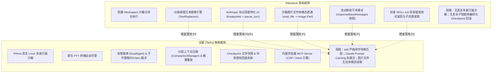
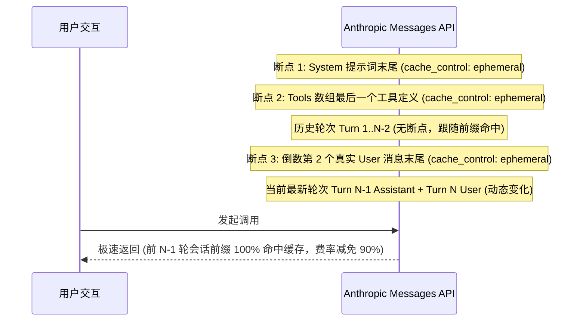
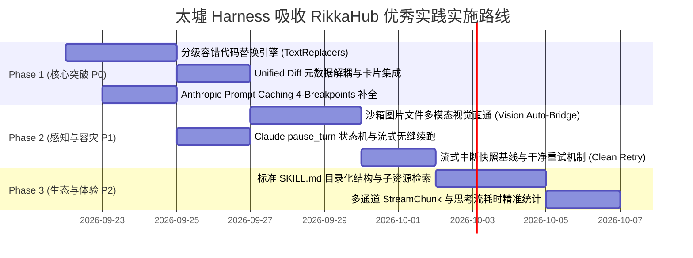

# RikkaHub 对标分析与 Harness 演进落盘规划

> 对标对象：[rikkahub/rikkahub](https://github.com/rikkahub/rikkahub)（Android 原生多厂商 LLM 聚合客户端与工作区智能体，Kotlin + Jetpack Compose）  
> 分析日期：2026-09-21  
> 方法论：深入研读 RikkaHub 的 `ai` 模块（Provider 抽象与实现）、`data/ai` 引擎（GenerationLoop、Transformers、Tools）、`workspace` 工具层与相关单元测试用例，逐项对照太墟（TaiXu）当前 `harness` 模块的源码现状，给出精准的文件行号对标、算法规格设计与分阶段落地方案。

---

## 1. 结论速览与技术定位对比 (Executive Summary)

太墟与 RikkaHub 虽然都是基于 Android + Kotlin + Jetpack Compose 构建的 AI 项目，但两者的系统定位与架构侧重有着鲜明的分野：

* **太墟 (TaiXu / LinuxAIRuntime)**：核心定位是 **Android 移动端 Linux 深度沙箱 + 专业 AI Agent 运行环境**。其架构优势集中在基础设施层与宏观编排层：基于 PRoot 的全功能 Linux 多发行版沙箱、原生 PTY 终端会话托管、双智能体编排（`DualAgentCoordinator`）、子智能体任务声明宿主裁决（`SubagentClaim`）、基于分层摘要与 Cache-Replay 的长会话上下文压缩（`CompactionManager`）、工业级 Checkpoint 文件快照与冲突感知回滚系统（`RewindController`）以及内置浏览器 MCP Server（支持 CDP 断点与 Hook 引擎）。
* **RikkaHub**：核心定位是 **Android 原生多模型聚合客户端与移动端轻量工作区智能体**。其架构优势集中在**大模型协议工程的微观精细打磨**：对主流闭源与开源大模型（OpenAI Responses API、Anthropic Claude、Google Gemini、Vertex AI、Ollama 等）最新协议规范的极致适配、代码编辑的高容错分级替换算法、沙箱产物的多模态视觉感知、移动弱网流式中断的干净重试机制、以及与业界标准对齐的目录级渐进式 Skill 发现机制。

### 核心收益与价值矩阵

对照 RikkaHub 的优秀工程设计，太墟当前在 Harness 层存在数个直接制约实际编码体验与 Token 成本的薄弱点。我们提炼出以下核心借鉴点，并设定明确的落地优先级：

| 优先级 | 借鉴条目 | 核心机制与改动点 | 太墟当前现状 (`harness`) | 预期收益 | 落地规划状态 |
| :--- | :--- | :--- | :--- | :--- | :--- |
| **P0** | **多级容错代码编辑引擎** | 引入 `Exact` $\to$ `LineTrimmed`（带目标缩进自动重排） $\to$ `BlockAnchor`（首尾锚点匹配）三级降级责任链；解耦 Unified Diff 元数据供前端渲染 | [`WorkspaceFileAccess.kt`](../harness/src/main/java/top/wkbin/taixu/harness/WorkspaceFileAccess.kt#L148-L151) 仅走严格 `indexOf`，空格/缩进/换行稍有偏差即报错 | **大幅提升模型代码修改成功率**，彻底消除缩进/CRLF 引起的“未找到匹配”，前端获得零上下文开销的 Git Diff 对比视图 | 规划中（第一阶段） |
| **P0** | **Anthropic Prompt Caching 4-Breakpoints 布局** | 在 System 尾部、Tools 尾部、**倒数第二轮真实用户消息**放置 `cache_control: {"type": "ephemeral"}`，支持 1h TTL 扩展 | [`AnthropicApi.kt`](../harness/src/main/java/top/wkbin/taixu/harness/AnthropicApi.kt#L210-L377) 仅解析 usage 统计，请求体内未注入任何 `cache_control` | **Claude 前缀缓存真正生效**，长会话输入 Token 计费直降 80%~90%，首字延迟 (TTFT) 缩减一个量级 | 规划中（第一阶段） |
| **P1** | **Anthropic `pause_turn` 续流状态机** | 捕获 `stop_reason == "pause_turn"` 原样回放 assistant 消息，重基服务端工具块索引 (`rebaseClaudeServerToolIndexes`) 并累加 Token | 太墟未处理 `pause_turn`，模型长时间思考或执行复杂长任务时会被意外截断或报错 | 完美契合 Claude 最新长推理与 Agent 托管协议，保障长任务连贯推进 | 规划中（第二阶段） |
| **P1** | **沙箱文件多模态视觉直通 (Vision Auto-Bridge)** | `read` 工具检测图片后缀时读取二进制转为 Base64/本地图片载荷，向多模态大模型输出视觉图像 | [`WorkspaceFileAccess.kt`](../harness/src/main/java/top/wkbin/taixu/harness/WorkspaceFileAccess.kt#L71) 强转 UTF-8，模型读取沙箱生成的图表/截图会乱码崩溃 | **赋予沙箱 Agent 视觉自我审查能力**，支持 Python/Matplotlib 作图、UI 渲染截图的闭环验证 | 规划中（第二阶段） |
| **P1** | **流式中断恢复的干净快照回滚 (Clean Stream Retry)** | 每次模型调用前建立干净消息快照基线，网络中断重发时重置缓冲区，严密隔离业务异常与网络异常 | [`HarnessProviderRunner.kt`](../harness/src/main/java/top/wkbin/taixu/harness/HarnessProviderRunner.kt#L69-L220) 具备网络重试，但需强化流式增量已渲染部分的无损擦除与状态幂等 | 彻底消除移动弱网环境下重复文字、半截 JSON 代码块污染后续对话上下文的问题 | 规划中（第二阶段） |
| **P2** | **目录级标准 SKILL.md 渐进式发现** | 系统提示词仅挂轻量 catalog 清单，`load_skill(name, path)` 按需深度读取 `SKILL.md` 正文及子脚本/参考资料 | [`BuiltinSkills.kt`](../core/model/src/main/java/top/wkbin/taixu/core/model/AgentSkill.kt#L22) 均为数据库单字段硬编码字符串，无法挂载复合项目资源 | 削减常驻系统提示词开销，与业界主流 Agent Skills 规范标准无缝对接 | 规划中（第三阶段） |
| **P2** | **多通道 StreamChunk 思考流与耗时统计** | 显式跟踪 Reasoning 的生命周期 (`createdAt` / `finishedAt`)，解耦 ServerTool 与 ClientTool | 太墟主要基于字符串增量拼接，思考耗时展示缺乏独立结构化事件流支撑 | 获得媲美顶级原生客户端的“已深度思考 3.8 秒”平滑状态展示与服务端工具透明感知 | 规划中（第三阶段） |

---

## 2. 架构级对比矩阵 (Taixu vs RikkaHub)



---

## 3. 关键技术点深度解剖与代码级规划

### 专题一：分级容错代码编辑引擎 (Multi-Tier Fault-Tolerant Text Replacer)

#### 1. 痛点剖析
在太墟当前的 [`WorkspaceFileAccess.kt`](../harness/src/main/java/top/wkbin/taixu/harness/WorkspaceFileAccess.kt#L148-L151) 中，`edit` 工具的实现如下：
```kotlin
val content = file.readText(Charsets.UTF_8)
val first = content.indexOf(oldText)
check(first >= 0) { "oldText 未找到" }
check(first == content.lastIndexOf(oldText)) { "oldText 匹配多处，请提供更精确的上下文" }
write(path, content.replaceRange(first, first + oldText.length, newText))
```
**现实痛点**：大模型生成代码修改时，普遍存在由于 Token 预测导致的微小瑕疵：
* 多余或遗漏缩进空格（例如原文件是 4 空格，模型输出了 2 空格或制表符）；
* 行尾多出或缺少空白字符；
* Windows CRLF 与 Linux LF 换行符的混淆。
只要发生以上任何微小偏差，严格的 `content.indexOf(oldText)` 就会立刻返回 `-1` 并抛出 `"oldText 未找到"`。模型不得不花费额外的轮次重新调用 `read`，甚至陷入死循环。

#### 2. RikkaHub 的算法实现分析
RikkaHub 的 `TextReplacers.kt` 定义了标准的三级降级匹配策略：

1. **第一级：`ExactReplacer` (严格匹配)**
   * 直接调用 `content.indexOf(oldText)`，保持最高速度与完全准确性。
2. **第二级：`LineTrimmedReplacer` (行级去空白容错 + 真实缩进重排)**
   * 将目标文本与搜索文本按行切分并分别去除首尾空白（`trim()`）。
   * 采用滑动窗口算法：在原文中滑动寻找行级去空白后与 `oldText` 行序列完全一致的区间。
   * **核心亮点（自动计算缩进）**：一旦命中，提取命中区间首行的真实缩进量（`oldIndent`）与 `newText` 的基准缩进量，自动对 `newText` 的每一行进行重新缩进对齐！保证替换后的代码语法缩进与原工程浑然一体。
3. **第三级：`BlockAnchorReplacer` (首尾锚点容错)**
   * 当待替换文本达到或超过 3 行时启用。
   * 仅匹配第一行与最后一行（去空白后相等），容忍中间行的细微差异。
   * 适用场景：模型在修改长函数或配置块时，中间某些无害行发生了轻微格式错乱。

#### 3. 太墟落地架构设计
在太墟 `harness` 模块内新建包 `top.wkbin.taixu.harness.text`：

```kotlin
package top.wkbin.taixu.harness.text

interface TextReplacer {
    val name: String
    fun findMatches(content: String, oldText: String, newText: String): List<Match>

    data class Match(
        val start: Int,
        val endExclusive: Int,
        val replacement: String,
    )
}

data class ReplaceTextResult(
    val updated: String,
    val replacements: Int,
    val occurrences: Int,
    val strategy: String,
    val diff: String? = null,
)

object ExactReplacer : TextReplacer {
    override val name: String = "exact"
    override fun findMatches(content: String, oldText: String, newText: String): List<TextReplacer.Match> {
        val matches = mutableListOf<TextReplacer.Match>()
        var index = content.indexOf(oldText)
        while (index >= 0) {
            matches += TextReplacer.Match(index, index + oldText.length, newText)
            index = content.indexOf(oldText, index + oldText.length)
        }
        return matches
    }
}

abstract class LineWindowReplacer : TextReplacer {
    protected abstract fun windowMatches(windowTrimmed: List<String>, oldTrimmed: List<String>): Boolean
    protected open fun isApplicable(oldTrimmed: List<String>): Boolean = oldTrimmed.any { it.isNotEmpty() }

    override fun findMatches(content: String, oldText: String, newText: String): List<TextReplacer.Match> {
        val rawOldLines = oldText.lines()
        val dropTrailingEmpty = rawOldLines.size > 1 && rawOldLines.last().isEmpty()
        val oldLines = if (dropTrailingEmpty) rawOldLines.dropLast(1) else rawOldLines
        val oldTrimmed = oldLines.map { it.trim() }
        if (!isApplicable(oldTrimmed)) return emptyList()
        val adjustedNewText = if (dropTrailingEmpty) newText.removeSuffix("\n").removeSuffix("\r") else newText

        val contentLines = splitLinesWithOffsets(content)
        val matches = mutableListOf<TextReplacer.Match>()
        var index = 0
        while (index + oldLines.size <= contentLines.size) {
            val window = contentLines.subList(index, index + oldLines.size)
            if (windowMatches(window.map { it.text.trim() }, oldTrimmed)) {
                val replacement = reindent(
                    text = adjustedNewText,
                    oldIndent = indentOf(oldLines.first()),
                    newIndent = indentOf(window.first().text),
                )
                matches += TextReplacer.Match(window.first().start, window.last().endExclusive, replacement)
                index += oldLines.size
            } else {
                index++
            }
        }
        return matches
    }
}

object LineTrimmedReplacer : LineWindowReplacer() {
    override val name: String = "line_trimmed"
    override fun windowMatches(windowTrimmed: List<String>, oldTrimmed: List<String>): Boolean =
        windowTrimmed == oldTrimmed
}

object BlockAnchorReplacer : LineWindowReplacer() {
    override val name: String = "block_anchor"
    override fun isApplicable(oldTrimmed: List<String>): Boolean =
        oldTrimmed.size >= 3 && oldTrimmed.first().isNotEmpty() && oldTrimmed.last().isNotEmpty()

    override fun windowMatches(windowTrimmed: List<String>, oldTrimmed: List<String>): Boolean =
        windowTrimmed.first() == oldTrimmed.first() && windowTrimmed.last() == oldTrimmed.last()
}
```

#### 4. Git Unified Diff 元数据解耦设计
在 `WorkspaceFileAccess.edit` 中生成标准 Unified Diff：
```kotlin
val result = TextReplacerEngine.replace(originalContent, oldText, newText)
val diff = UnifiedDiffGenerator.diff(originalContent, result.updated, path)
```
* **解耦契约**：生成的 `diff` 字符串存入 `ToolResult.metadata["diff"]`；
* **前端展示**：太墟 `feature/chat` 的 `ToolResultCard` 读取 `metadata["diff"]`，渲染高颜值的两栏/行内代码对比（复用已有的 `DiffView`）；
* **上下文保护**：在 `ApiContextAssembler` 组装发给大模型的上报报文时，仅输出简短文本（如 `已修改 path (匹配策略: line_trimmed, 1 处)`），**彻底剔除 diff 文本**，防止重复占用昂贵的上下文 Token。

---

### 专题二：Anthropic Claude 协议深度特化 (Prompt Caching 4-Breakpoints & pause_turn)

#### 1. 痛点剖析
查阅太墟当前的 [`AnthropicApi.kt`](../harness/src/main/java/top/wkbin/taixu/harness/AnthropicApi.kt)：
```kotlin
// AnthropicApi.kt:357
if (!model.pureChatMode && systemPrompt.isNotEmpty()) put("system", systemPrompt.toString())

// AnthropicApi.kt:360-374
if (!model.pureChatMode && model.toolCallMode == ToolCallMode.NATIVE && dynamicTools.isNotEmpty()) {
    put("tools", buildJsonArray {
        dynamicTools.forEach { definition ->
            add(buildJsonObject {
                put("name", definition.function.name)
                put("description", definition.function.description)
                put("input_schema", definition.function.parameters)
            })
        }
    })
}
```
**严重问题**：虽然代码后文解析了 `cache_read_input_tokens`，但整个请求中**压根没有注入任何 `cache_control` 标记**！这意味着 Claude 的 Prompt Caching 在太墟中实质上从未被触发，所有会话轮次均按全量价格计费，首字延迟居高不下。

#### 2. RikkaHub 的 4-Breakpoints 黄金排布策略
Anthropic 官方规定单次请求最多容纳 4 个缓存断点。RikkaHub 实现了极具数学美感与工程效能的排布：



* **为什么放在“倒数第二轮真实用户消息”？**
  * 在多轮对话中，当前最新轮次用户刚刚输入提问，内容是全新的；
  * 如果把断点放在最新用户消息，由于当前轮每次提问都不同，本次调用无法命中该断点；
  * 而**倒数第二轮用户消息及之前的所有对话内容，在上一轮就已经完全确定且再也不会改变**！
  * 因此，将第三个断点锚定在倒数第二轮用户消息末尾，可以确保当前请求除了最新这一句提问之外，前面的整个庞大历史树**全量命中前缀缓存**！

#### 3. 落地改造规格 (`AnthropicApi.kt`)
修改 `AnthropicApi.buildRequest`：
```kotlin
// 1. System Prompt 结构化 Block 转换
if (systemPrompt.isNotEmpty()) {
    put("system", buildJsonArray {
        add(buildJsonObject {
            put("type", "text")
            put("text", systemPrompt.toString())
            if (model.promptCachingEnabled) {
                put("cache_control", buildJsonObject { put("type", "ephemeral") })
            }
        })
    })
}

// 2. Tools 数组尾部注入缓存断点
if (model.toolCallMode == ToolCallMode.NATIVE && dynamicTools.isNotEmpty()) {
    put("tools", buildJsonArray {
        dynamicTools.forEachIndexed { i, def ->
            add(buildJsonObject {
                put("name", def.function.name)
                put("description", def.function.description)
                put("input_schema", def.function.parameters)
                if (model.promptCachingEnabled && i == dynamicTools.lastIndex) {
                    put("cache_control", buildJsonObject { put("type", "ephemeral") })
                }
            })
        }
    })
}

// 3. Messages 历史倒数第二轮 User 消息断点注入
val realUserIndices = anthropicMessages.mapIndexedNotNull { index, msg ->
    if (msg["role"]?.jsonPrimitive?.contentOrNull == "user") index else null
}
if (model.promptCachingEnabled && realUserIndices.size >= 2) {
    val targetIndex = realUserIndices[realUserIndices.size - 2]
    // 对 targetIndex 消息的最后一个 content block 注入 cache_control
    anthropicMessages[targetIndex] = injectCacheControlToMessage(anthropicMessages[targetIndex])
}
```

#### 4. Claude `pause_turn` 续流状态机
Anthropic 新规范中，当遇到超长 CoT 思考或长时间服务端任务时，可能返回 `stop_reason: "pause_turn"`。
RikkaHub 封装了 `streamClaudeWithPauseTurn`：
* **核心语义**：`pause_turn` 要求调用方**原样回传当前生成的 assistant 消息**继续请求，严禁插入任何人工 `"Continue"` 用户消息！
* **索引重基**：重基服务端工具块下标（`rebaseClaudeServerToolIndexes`），将连续两个流片段平滑拼接成一条无缝的完整回复，并累加中间轮次的 Token 统计。

---

### 专题三：沙箱文件多模态视觉直通 (Sandbox Workspace Multi-Modal Vision Auto-Bridge)

#### 1. 痛点剖析
太墟支持执行复杂的 Linux 命令和 Python 脚本。典型的场景：
* 用户：“帮我写个 Python 脚本，画出系统内存趋势图。”
* Agent 执行 Python 脚本生成了 `memory_trend.png`。
* 此时 Agent 为了验证画图是否正确，通常会下意识调用 `read(path="memory_trend.png")`。
* **现状后果**：[`WorkspaceFileAccess.kt`](../harness/src/main/java/top/wkbin/taixu/harness/WorkspaceFileAccess.kt#L71) 执行 `file.readText(Charsets.UTF_8)`，返回一堆二进制乱码或触发字符集异常，模型直接陷入混乱。

#### 2. RikkaHub 的视觉桥接机制
RikkaHub 在 `WorkspaceTools.kt` 中做了极佳的后缀探针：
```kotlin
private val IMAGE_EXTENSIONS = setOf("png", "jpg", "jpeg", "gif", "webp", "bmp", "svg", "ico")

if (path.isImagePath()) {
    workspaceRepository.readImageInRootfs(workspaceId, path)
} else {
    workspaceRepository.readTextInRootfs(workspaceId, path)
}
```
读取二进制字节后，将其转换为 `UIMessagePart.Image(url = "data:image/png;base64,...")`，作为工具执行结果传回给支持多模态的大模型。

#### 3. 太墟落地设计
在 `ToolExecutor.executeTool` 的 `HarnessTool.READ` 分支增加智能多模态探针：
```kotlin
HarnessTool.READ -> {
    val path = requireString(args, "path")
    val isImage = path.substringAfterLast('.', "").lowercase() in IMAGE_EXTENSIONS
    if (isImage && currentModel.supportsVision) {
        val bytes = activeFileAccess.readRawBytes(path)
        val base64 = Base64.encodeToString(bytes, Base64.NO_WRAP)
        val mimeType = resolveMimeType(path)
        ToolResult(
            success = true,
            output = "图片文件读取成功：$path",
            imagePayload = "data:$mimeType;base64,$base64" // 组装为多模态内容块注入下一步请求
        )
    } else {
        // 原有文本分页读取逻辑
        ...
    }
}
```
**收益**：使太墟沙箱内的 Agent 真正拥有了“眼睛”，能够进行前端 UI 渲染核验、自动化图像排版审查等闭环操作。

---

### 专题四：流式请求中断状态回滚与异常安全隔离 (Clean Stream Retry)

#### 1. 痛点剖析
在移动端场景下，WiFi 切换到 5G 或网络微弱闪断极为频繁。如果模型在流式输出到一半（例如已经吐出了 300 字）时连接重置（`SocketTimeoutException`）：
* 若简单进行原地上层重试，下一次重试的新流可能会拼接到前一次残留的半截字符之后；
* 若网络失败抛错，UI 上可能残留着一段尚未闭合的 Markdown 标签或残缺的 JSON 块。

#### 2. RikkaHub 的快照隔离机制
RikkaHub 在 `GenerationLoop.kt` 中树立了极其严密的异常屏障：
```kotlin
// 1. 在发起调用前，先锁定当前会话消息基线
val responseBaseMessages = if (messages.lastOrNull()?.role == MessageRole.ASSISTANT) {
    messages
} else {
    messages + UIMessage(role = MessageRole.ASSISTANT, parts = emptyList(), modelId = model.id)
}
var retryCount = 0

while (true) {
    val streamChunkHandler = StreamChunkHandler(model)
    var attemptMessages = responseBaseMessages // 每次重试都从完整、干净的快照重新累积！
    try {
        providerImpl.streamText(...).collect { chunk ->
            try {
                attemptMessages = streamChunkHandler.handle(attemptMessages, chunk)
                onUpdateMessages(attemptMessages)
            } catch (error: CancellationException) {
                throw error
            } catch (error: Throwable) {
                // 关键点：下游 UI 更新或本地转换异常不是网络故障，严禁误触发网络请求重放！
                throw StreamChunkHandlingException(error)
            }
        }
        messages = attemptMessages
        break
    } catch (error: Throwable) {
        if (error is StreamChunkHandlingException) {
            throw error.cause ?: error
        }
        // 仅对真正的底层 IOException 进行指数退避重试，并更新状态提示
        retryCount = awaitNetworkRetryOrThrow(error, retryCount, processingStatus, enabled)
    }
}
```

#### 3. 太墟落地建议
* 在 `TurnRunner` 与 `HarnessProviderRunner` 的流式处理循环中，引入 `StreamBaselineSnapshot` 机制；
* 区分 `CancellationException`（用户点击停止，秒级中断并保留已有内容）、`StreamChunkHandlingException`（本地解析/持久化异常，原样终止不重试）与 `IOException`（网络异常，彻底清空本轮已渲染的局部脏数据后干净退避重试）。

---

### 专题五：目录级标准 SKILL.md 渐进式发现与子资源读取

#### 1. 痛点剖析
太墟当前的技能系统定义在 [`AgentSkill.kt`](../core/model/src/main/java/top/wkbin/taixu/core/model/AgentSkill.kt#L6-L19)：
```kotlin
data class AgentSkill(
    val id: String,
    val name: String,
    val description: String,
    val systemPrompt: String,
    val triggerCommand: String? = null,
    val resourcePath: String? = null,
)
```
现存技能均通过写死的大段 `systemPrompt` 字符串注入。如果一个技能包含详细的使用示例、参考速查表或可执行 Python 脚本，将其全部写在 `systemPrompt` 中会导致加载后上下文迅速膨胀。

#### 2. RikkaHub 的标准 `use_skill` 模式
RikkaHub 遵循标准的 Agent Skill 结构（一个包含 `SKILL.md` 及子目录的文件夹）：
* 系统提示词中只暴露极度精简的元数据索引：
  ```xml
  <available_skills>
    <skill>
      <name>android_reverse</name>
      <description>Android 逆向与 APK 静态审计专家</description>
    </skill>
  </available_skills>
  ```
* 暴露标准工具 `use_skill(name, path)`：
  * 当 `path == null` 时：读取根目录 `SKILL.md` 的正文（自动剔除 YAML frontmatter）；
  * 当 `path` 指向子文件时（如 `references/smali_opcodes.md` 或 `scripts/dump_dex.sh`）：在沙箱内按受限相对路径读取该辅助文件。

#### 3. 太墟落地建议
* 保持现有 `HarnessTool.LOAD_SKILL` 枚举不变，扩展其入参为 `(name: String, path: String? = null)`；
* 统一支持读取太墟内置私有目录（`skills/`）以及沙箱工作区内项目根目录（`.agents/skills/`）的标准 Skill 结构，实现与开源社区 Skills 的开箱即用兼容。

---

## 4. 实施落地全周期规划 (Implementation Roadmap)



### Phase 1：代码编辑稳健度与 Claude 成本断崖式优化 (预计周期：5 天)
* **交付物 1**：实现 `top.wkbin.taixu.harness.text.TextReplacers`，包含单元测试（覆盖 Exact、LineTrimmed 缩进对齐、BlockAnchor 边界情况、CRLF/LF 混合换行符）；
* **交付物 2**：修改 `WorkspaceFileAccess.edit`，集成多级替换引擎，成功后输出 Unified Diff 并附在 `ToolResult.metadata`；
* **交付物 3**：重构 `AnthropicApi.kt` 的 `buildRequest`，注入 System、Tools 与倒数第二轮 User 消息的 `cache_control`，并验证缓存命中率指标。

### Phase 2：多模态闭环与长思考容灾 (预计周期：5 天)
* **交付物 1**：在 `ToolExecutor.executeTool(HarnessTool.READ)` 中增加视觉模型图片探针，实现沙箱图片文件的自动 Base64/多模态块封装；
* **交付物 2**：在 `AnthropicApi` 中实现 `pause_turn` 捕获循环与工具块下标重基；
* **交付物 3**：在 `TurnRunner` 中固化流式初始快照，确保网络闪断退避重试时无脏字符残留。

### Phase 3：技能规范拉齐与思考耗时度量 (预计周期：5 天)
* **交付物 1**：扩展 `HarnessTool.LOAD_SKILL` 为支持 `(name, path)`，打通工作区 `.agents/skills` 目录结构；
* **交付物 2**：重构思考流生命周期管理，向前端提供确切的毫秒级“思考耗时”展示。

---

## 5. 太墟不可动摇的核心壁垒 (Core Tenets to Preserve)

在借鉴 RikkaHub 的微观协议与工具打磨经验的同时，太墟**必须绝对保持自身已有的核心系统优势，严禁倒退或盲目重构**：

1. **绝对坚持基于 PRoot 的全功能 Linux 多发行版沙箱**：
   * RikkaHub 的工作区本质上是轻量目录与受限进程执行；太墟具备真正的 glibc 运行环境、多发行版 RootFS、原生 PTY 终端以及后台进程守护体系（`ProcessManager`），这是太墟支撑移动端复杂离线编译（JDK 17/NDK/AAPT2/Flutter）的立足之本。
2. **绝对坚持双智能体与多智能体（DualAgent / Subagents）协作架构**：
   * 太墟具备完善的主/子代理并发调度、Lane 转写隔离、写租约收缩、以及基于真实执行凭据的 `SubagentClaim` 宿主核验裁决机制（见 `docs/REASONIX_BORROWING_ANALYSIS.md`）。这是工业级复杂编码代理的基石。
3. **绝对坚持前缀缓存友好的分层上下文压缩 (`CompactionManager`)**：
   * 太墟的压缩机制采用“折叠历史前缀 + 仅在末尾注入压缩指令”的 Cache-Replay 模式，将长会话压缩成本压缩了一个量级，此机制领先于业界的普通滑动窗口丢弃策略。
4. **绝对坚持带磁盘配额护栏与外部修改检测的 Checkpoint 回退系统**：
   * 太墟具备 64MB 会话快照预算淘汰保护、基于 `latestAfterImage` 的外部改动冲突检测跳过、以及单层级 `undoLastRewind` 撤销回滚。这种防丢码、防覆盖的安全防线必须完整保持。
